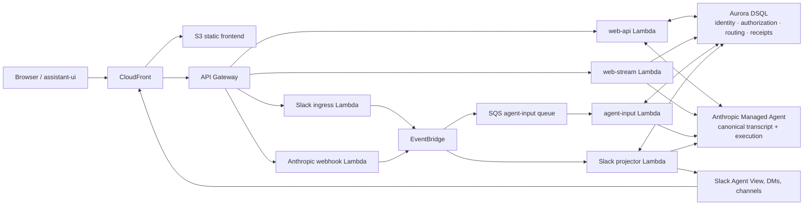

# Managed Agent Web + Slack

A reference implementation for continuing the same Anthropic Managed Agent session
across an assistant-ui web application and Slack. It deploys as an AWS serverless
application and keeps its application-side state deliberately small.

This is a reference implementation and is not an official Anthropic, Slack, AWS,
or assistant-ui project.

> Anthropic is the canonical conversation and execution store. Aurora DSQL stores
> identity, authorization, routing, idempotency, and projection metadata—not a
> duplicate transcript, tool output, or reasoning record.

## Architecture



## Try it locally

Prerequisites: Node.js 22+, Python 3.14 with [uv](https://docs.astral.sh/uv/),
Docker with Compose v2, and Chromium for Playwright. The local E2E runner installs
Chromium when needed.

```bash
npm ci
uv sync --directory backend --locked
npm run dev:e2e
```

Open `http://127.0.0.1:3000` and sign in with `e2e-access-token`. This starts a
disposable PostgreSQL database plus deterministic Anthropic and Slack adapters.
It needs no AWS, Slack, or Anthropic credentials and leaves no provider state.

Run the normal checks with:

```bash
./scripts/verify --fast
./scripts/verify --full
```

See [testing guidance](docs/testing.md) for focused, semantic E2E, and separately
opt-in live smoke tests.

## Deploy with real providers

Real deployment requires an AWS account and usable credentials, Terraform,
Anthropic Managed Agent IDs and API credentials, and a Slack app. Copy
`.env.example` to an untracked `.env` and set `CLAUDE_AGENT_ID`,
`CLAUDE_ENVIRONMENT_ID`, `ANTHROPIC_API_KEY`, `WEB_ACCESS_TOKEN`, and
`WEB_COOKIE_SECRET`; `AGENT_ID` is only a compatibility alias.

`AWS_PROFILE` and `AWS_REGION` select the target. `EXPECTED_AWS_ACCOUNT_ID` is
an optional safety assertion. Remote state is rendered under `.generated/` using
a deterministic per-account bucket name, or an explicit `TF_STATE_BUCKET` for an
existing deployment.

```bash
aws sso login --profile default
./scripts/deploy.sh
npm run slack:manifest
```

The wrapper validates deployment settings, discovers the target account, bootstraps
remote state when necessary, deploys, syncs secrets to Secrets Manager, migrates
and seeds DSQL, uploads the frontend, and renders a Slack manifest. Import the
generated `.generated/slack-manifest.yaml`, keep Socket Mode disabled, then
set `PUBLIC_APP_URL` to the Terraform `application_url` output, add locally held
Slack credentials and identity mappings, choose feature gates, and rerun
`./scripts/deploy.sh` to synchronize Lambda configuration and secrets. Leave
URL-dependent Slack gates disabled during the initial deployment.

Terraform outputs are authoritative for the application URL, callback URLs, DSQL
endpoint, and resource names. See [operations](docs/operations.md),
[Managed Agent setup](docs/managed-agent-setup.md), [Slack setup](docs/slack-setup.md),
and [DSQL operations](docs/dsql.md) for the full lifecycle.

## Slack experience

The generated manifest configures Agent View, Events API delivery, signed
interactivity, shortcuts, and session-link unfurls. The application supports
authorized web/Slack session continuity, streaming task cards, source links,
exact-message receipt reactions, tool approvals, feedback, and thread replies;
each Slack capability is separately feature-gated and defaults off.

Every inbound Slack request is authenticated with Slack's timestamped signature.
The verified team and user IDs are authorized through DSQL; optional environment
allowlists can reject development traffic but never grant access.

## Contributing and security

Read [CONTRIBUTING.md](CONTRIBUTING.md) before changing architecture, persistence,
or provider boundaries. Report vulnerabilities through the repository's GitHub
Private Vulnerability Reporting flow; do not put secrets in an issue. Details are
in [SECURITY.md](SECURITY.md).
