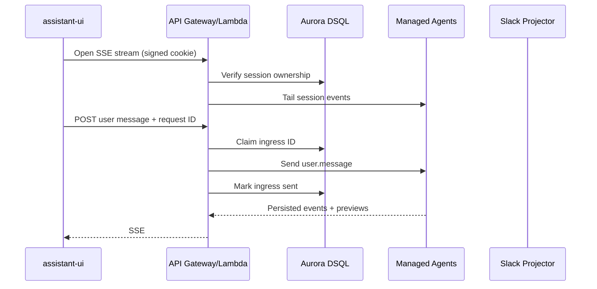
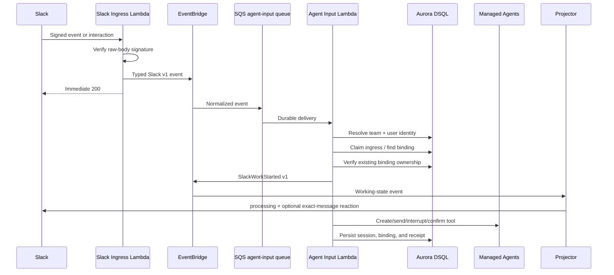
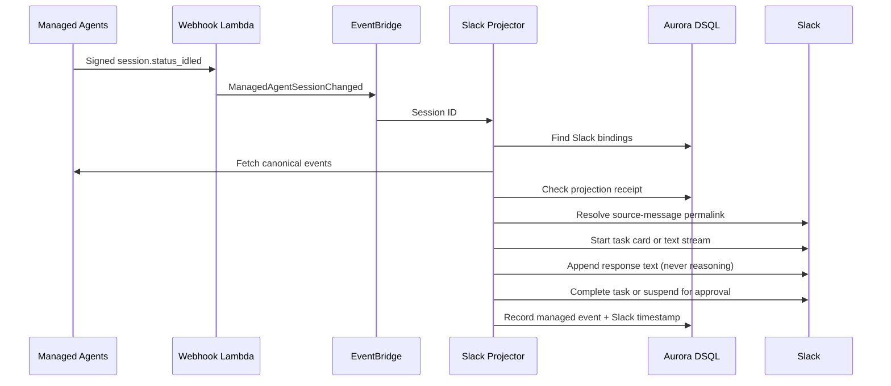
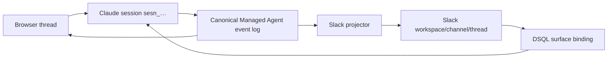
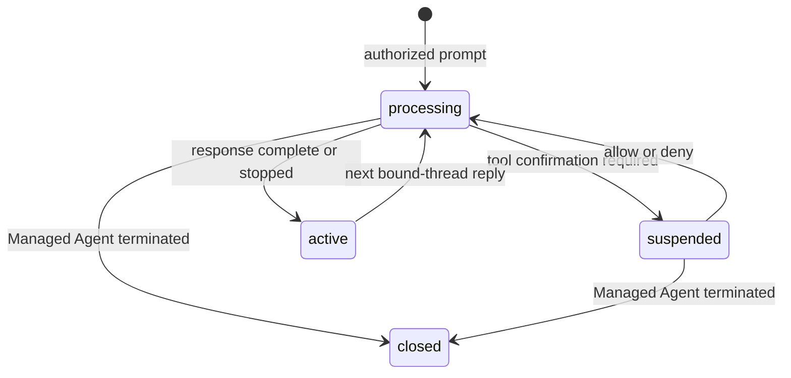

# Architecture

## Ownership

- Claude Managed Agents: canonical conversation event log, execution history, session/thread status, and sandbox state.
- Aurora DSQL: principals, external identities, session authorization, surface bindings, ingress idempotency, feedback metadata, stream leases, and Slack projection receipts.
- EventBridge: asynchronous Slack messages/actions, projection requests, Managed Agent change notifications, and control replies.
- Python 3.14 Lambdas: stateless protocol and authorization adapters. Browser SSE uses FastAPI through Lambda Web Adapter response-stream mode.
- Slack and assistant-ui: input/projection surfaces over the same Claude session ID.

DSQL deliberately has no message or transcript table.

## Browser turn

## Slack inbound

## Slack projection

## Shared session

## Trust boundaries

- Slack signature verification authenticates Slack as the sender. The signed `team_id` and `user_id` are identity claims, not credentials.
- DSQL `external_identities(provider='slack', tenant_id, external_user_id)` authorizes the Slack identity as an application principal.
- Optional environment allowlists can reject development traffic before lookup but can never authorize an unmapped identity.
- Browser session cookies are signed and every session ID is checked against `agent_sessions` before an Anthropic API request.
- Anthropic and Slack service credentials remain server-side.

## Slack-native lifecycle

Live output uses `chat.startStream`, coalesced `chat.appendStream`, and `chat.stopStream`. Only text deltas are projected. Text streams use Slack's `markdown_text` request field; task-card streams use chunks for their full lifetime, including `markdown_text` response chunks and recovery finalization. The task source is attached when the stream starts, so recovery does not need to persist message content or a permalink. If streaming fails after Slack creates a message, `slack_response_streams` retains the timestamp and request ID so the webhook projector finalizes that message instead of posting a duplicate.

`SlackWorkStarted` is emitted only after ingress claim, identity authorization, input validation, and existing-binding ownership checks, but before Claude delivery. It contains routing identifiers and the exact triggering message timestamp—never message text. Projector failures retry independently and cannot cause a second Claude input.

Shortcuts fetch the authorized Slack thread at execution time and pass it to Anthropic as explicitly untrusted reference context. Message bodies are never persisted in DSQL. Active context is similarly ephemeral and feature-gated.
