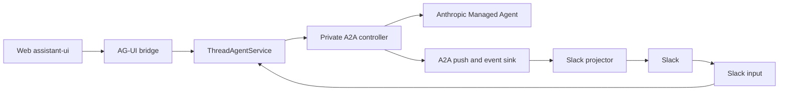

# Architecture

## Ownership

- Web and Slack own application thread presentation. Web sends AG-UI to the cookie-authenticated bridge; Slack sends signed events and interactions to its ingress.
- The application control plane owns principal authorization, thread bindings, logical send idempotency, FIFO active-Task selection, and surface projection metadata in Aurora DSQL.
- The private A2A controller owns contexts, Tasks, provider-private CMA sessions, execution, human-input requests, scheduler state, and push delivery.
- Anthropic owns the canonical conversation and execution transcript. DSQL stores no message, tool-output, or reasoning content.

```mermaid
flowchart LR
  Web[Web assistant-ui] --> Bridge[AG-UI bridge]
  Slack[Slack] --> Input[Slack input]
  Bridge --> Plane[ThreadAgentService]
  Input --> Plane
  Plane --> A2A[Private A2A controller]
  A2A --> CMA[Anthropic Managed Agent]
  A2A --> Push[A2A push and event sink]
  Push --> Projector[Slack projector]
  Projector --> Slack
```

## Task lifecycle

A browser `runId` and a Slack event ID identify retryable logical sends. `ThreadAgentService` binds each to a controller Task. The earliest nonterminal Task in controller FIFO order is active. Web reload reads canonical A2A history and a resume snapshot; Slack projection reads current Task state. Neither treats subscription closure as completion. Explicit Stop cancels the active A2A Task and the controller handles any provider interrupt.

Human-input controls carry the A2A Task ID and controller `requestId`. An atomic controller decision makes the first valid response win across Web and Slack. Equivalent retries converge; a conflicting decision is rejected. Pending answers and denial reasons use temporary object storage; DSQL holds only opaque keys.

## Web boundary

The browser receives application thread IDs and AG-UI events. The bridge verifies its signed cookie and `agent_threads.principal_id` before run, history, resume, and cancellation. The browser never receives the private A2A endpoint, CMA session IDs, or provider event streams. Conversation links use `?thread=<uuid>`.

## Slack boundary

Ingress verifies Slack's timestamped HMAC signature, then resolves the verified workspace and human user through `external_identities`. It checks existing binding ownership before input reaches A2A. `SlackWorkStarted` is emitted after authorization and before controller delivery; projection failures cannot duplicate the authorized send. Reactions and source permalinks refer to the exact triggering Slack message. Task-card streams use chunk mode for their full lifetime and expose no reasoning.

Slack's native `agent_session_stopped` event maps to cancellation of the active A2A Task. Slack provider-session links are unsupported; linking and unfurls use application thread IDs.

## Provider lifecycle and trust topology

The signed Anthropic webhook wakes the controller scheduler for a known controller-private CMA session. The controller reconciles its Task and pushes A2A state to the application event sink. Unknown provider sessions are ignored; there is no application session-change event. The private A2A API is restricted to its execute-api VPC endpoint, while the Web API, AG-UI bridge, Slack ingress, and Anthropic webhook are public entry points with their respective authentication. Only controller/provider components receive the Anthropic API credential.

The reference dev deployment uses a single AZ and NAT gateway. Production HA requires a separate infrastructure design.
